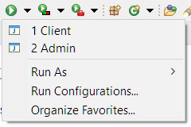

# DAM1 Projecte final
Per A. Gamez

## Base de dades
totes les taules estan en la carpeta `sql/`

## Executar
Per executar el programa en modus usuari o administrador es fa amb el mateix `Main`.

#### Eclipse
En eclipse hi ha dos configuracions disponibles



#### Linia de comandes
```bash
./main --user # obre el programa com usuari
./main --admin admin # obre el programa com administrador
```